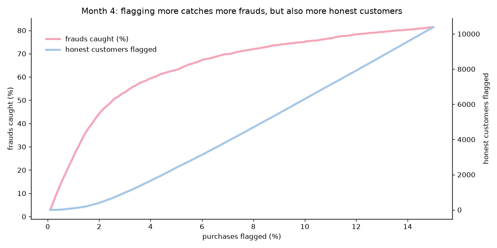
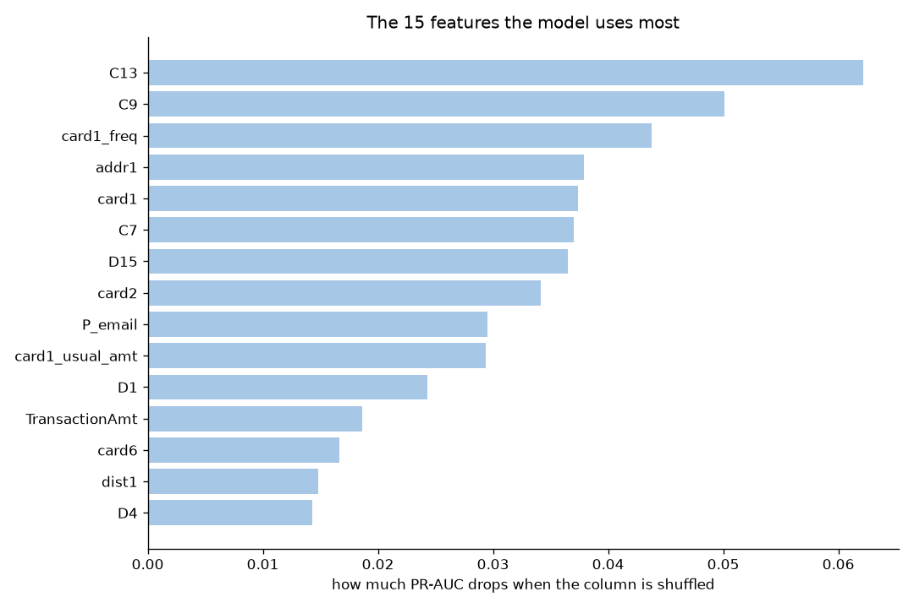

# fraud-detection

**Card fraud detection built the way a bank would run it.**

Most fraud projects on public data stop at "the model has a high score". A bank needs more: it has to know
how much money a model saves, how many honest customers it blocks, whether it still works next month, and
why a purchase was flagged. This project builds a fraud model on real e-commerce data with those questions
in mind.

## The data

[IEEE-CIS Fraud Detection](https://www.kaggle.com/competitions/ieee-fraud-detection/data), real online
purchases provided by Vesta (a payment protection company). Every row is **one online purchase made with a
card**. Customer, merchant and product are anonymised.

| | |
|---|---|
| purchases | 590,540 |
| columns | 394 (+ 41 in the identity table) |
| frauds | 20,663 (**3.5%**, about 1 purchase in 29) |
| period | 182 days (~6 months) |

**What "fraud" means here.** A purchase is fraud when the card owner disputed it with the bank
(chargeback). The purchases that follow it with the same account, email or billing address are marked as
fraud too: the label follows the person behind the fraud, not only the single purchase.

**The columns**

| columns | what they are |
|---|---|
| `TransactionDT` | time, in seconds from a hidden start (not a real date) |
| `TransactionAmt` | amount in USD |
| `ProductCD` | type of product (code) |
| `card1`–`card6` | anonymised card information (network, debit/credit, bank, country) |
| `addr1`, `addr2` | billing region and country (codes) |
| `dist1`, `dist2` | distances (e.g. between billing and shipping address) |
| `P_emaildomain`, `R_emaildomain` | email domain of buyer and receiver |
| `C1`–`C14` | counts (e.g. how many addresses are linked to the card) |
| `D1`–`D15` | days passed (e.g. since the card was first seen) |
| `M1`–`M9` | matches, true/false (e.g. name on card = name at address) |
| `V1`–`V339` | features built by Vesta, anonymous |
| identity table | device and browser (`DeviceType`, `DeviceInfo`, `id_01`–`id_38`) |

## Exploratory analysis

**Method.** The analysis uses only the first 4 months: the last 2 months are kept hidden as the final test
of the model. For every feature, three questions:
1. How many values are missing, and is the fraud rate different when the value is missing?
2. Which values or groups have more frauds? (numbers: 10 groups with the same number of purchases;
   codes: the most frequent values)
3. Is the feature useful?

**Accuracy is not a metric here.** With 3.5% of frauds, a model that always says "not fraud" is right
96.5% of the time and finds no fraud at all.

**Time.** The fraud rate changes month by month (from 2.5% to 4%), so the model is trained on the past
and tested on the future, never on a random split. At night frauds are 3x more frequent (10% vs 3%), but
most frauds still happen during the day, when there are many more purchases.


**What the data says**

| feature | finding |
|---|---|
| ProductCD | type C: 11% fraud, 3x the average; type W, the most common, is the safest (2%) |
| card6 | credit cards: 6.6% fraud vs 2.4% for debit cards |
| card3 | one value (probably foreign cards): 12.4% fraud on 40,000 purchases |
| C1 | the higher the count, the more fraud (2.4% → 8.6%) |
| D1 | cards seen recently are riskier (4.6% vs 1.3% for cards older than a year) |
| addr1 | when the billing address is missing: 11% fraud, 3x the average |
| R_emaildomain | with a receiver email (buying for someone else): up to 15% fraud |
| P_emaildomain | internet provider emails (att, verizon) are very safe (under 0.5%) |
| TransactionAmt | weak alone: more fraud for very small and very large amounts |

**Missing values carry information.** A value is not missing by chance: it describes how the purchase
happened. Without a billing address, fraud is 3x the average; with a receiver email, it is up to 4x. So
missing values are never filled with an average: they become "missing yes/no" features.

**Too many columns saying the same thing.** Many C, D and V columns are near copies of each other. For
every group of columns with correlation ≥ 0.95 (≥ 0.75 for the V columns) only one is kept: the one with
fewest missing values, then the strongest. 149 columns survive, out of ~430.

## Split in time

The model must work on purchases that have not happened yet, so the data is split by month, never at random:

| months | use |
|---|---|
| 0–3 | train: the model learns here |
| 4 | validation: compare models, tune settings, choose the threshold |
| 5 | test: used **once**, at the end |

Everything computed from the data (for example "the usual amount of a card code") uses the train months only.

## Features

Kept simple and readable, each one from an EDA finding:

| feature | meaning | fraud rate (yes vs no) |
|---|---|---|
| `addr1_missing` | no billing address | 11.2% vs 2.5% |
| `foreign_address` | billing country is not the main one | 11.1% vs 2.4% |
| `foreign_card` | card issued abroad | 10.8% vs 2.5% |
| `amt_odd_cents` | amount with more than 2 decimals (converted from another currency) | 11.2% vs 2.6% |
| `dist2_present` | the second distance exists | 9.2% vs 3.1% |
| `R_email_present` | a receiver email exists (buying for someone else) | 7.7% vs 2.1% |
| `has_identity` | device information exists | 7.3% vs 2.1% |
| `P_email`, `R_email` | email provider family (google, microsoft, apple, internet provider…) | microsoft 5.3%, internet provider 1.3% |
| `device`, `browser`, `system` | device families | huawei 19%, samsung 12%, mac 1.7% |
| `amt_vs_usual` | amount ÷ usual amount of the card code | weak |
| `card1_freq` | how common the card code is | |

**Why "different from the usual" is weak here.** Vesta marks as fraud also the purchases that follow a
disputed one with the same account, email or address. So the label follows the fraudster, and a fraudster's
purchases look like *their own* usual. Features that look for a change of behaviour help less than expected.

## Models

Month 4, flagging the 2% most suspicious purchases:

| model | PR-AUC | ROC-AUC | frauds caught | precision | fraud $ caught | training time |
|---|---|---|---|---|---|---|
| logistic regression | 0.384 | 0.830 | 31.0% | 53.9% | 20.3% | 28 s |
| random forest | 0.464 | 0.893 | 34.8% | 60.5% | 28.8% | 54 s |
| CatBoost | 0.551 | 0.902 | 41.4% | 71.9% | 38.1% | 589 s |
| **HistGradientBoosting** | **0.582** | **0.915** | **43.2%** | **75.1%** | **39.9%** | 67 s |

- **PR-AUC** (area under the Precision-Recall curve) is the main grade: with 3.5% frauds, ROC-AUC looks
  good even for weak models. A random model has PR-AUC 0.035.
- **Precision**: of the purchases we flag, how many are frauds. **Frauds caught** (recall): of all the
  frauds, how many we flag.
- XGBoost and LightGBM were not used: they need a system library (OpenMP) that could not be installed on
  the machine used. HistGradientBoosting (scikit-learn) is the same family of model.

**Tuning.** 48 combinations of settings, each trained on months 0–3 and graded on month 4 (not
cross-validation: it would mix the months). PR-AUC 0.582 → **0.597**. Only one setting really mattered:
bigger trees (`max_leaf_nodes` 31 → 127: 0.573 → 0.590).

## How many purchases to flag

The model gives a score; the bank decides from which score to flag. Flagging more catches more frauds but
also blocks more honest customers:



We flag **2%** of the purchases (the score threshold is chosen on month 4). The model is also compared with
simple rules, as a bank would start ("foreign card at night", "product C and no address"), giving the model
the same number of flags as each rule (table in notebook 05).

## Final test (month 5, used once)

| | was fraud | was honest |
|---|---|---|
| **flagged** | 1,318 | 598 |
| **not flagged** | 1,964 | 90,756 |

- 2.0% of purchases flagged
- **40% of the frauds caught** (1,318 of 3,282)
- **69% precision**: about 2 of every 3 flagged purchases are frauds
- **28% of the fraud dollars caught** ($140k of $495k)
- PR-AUC 0.513, ROC-AUC 0.899

**Honest reading.**
- PR-AUC drops from 0.597 (month 4) to 0.513 (month 5): fraud changes over time (drift), and the model is
  one month older. In production it would be retrained every month.
- Dollars caught (28%) are lower than frauds caught (40%): big frauds are harder to catch than small ones. A
  next step is to rank by expected loss (score × amount) instead of score alone.

**What the most important features are** (permutation importance: shuffle one column and see how much the
model gets worse):



## Investigator agent

For each flagged purchase, a small agent writes a note: why the model flagged it, what points against fraud,
what to check next. It runs on a **local LLM** (Ollama), so no data leaves the computer.

- **Tools** (plain Python, no invention): `purchase_facts` gives the readable facts of the purchase;
  `score_drivers` tells which features push the score up, by asking the model "what would the score be if
  this feature had the value of a typical honest purchase?".
- **The LLM** (LangChain + Ollama) chooses the tools, then writes the note.
- **Grounding check**: every number in the note must appear in the tool results; otherwise it is marked
  `NOT VERIFIED`.

```bash
cp .env.example .env               # choose the model
ollama pull qwen2.5:7b             # a model that supports tools
python src/fraud/agent.py --n 3    # notes for the 3 most suspicious purchases of month 5
python src/fraud/agent.py --id <TransactionID>
```

## What the Kaggle winners did differently

The first place ([writeup](https://www.kaggle.com/competitions/ieee-fraud-detection/writeups/fraudsquad-1st-place-solution-part-2))
reached ROC-AUC 0.946 on the hidden test (ours: 0.899). Their main idea: **rebuild the customer**
(card1 + addr1 + the day the card was first used) and compute ~45 averages per customer. Since the label
follows the fraudster, the model learns to **recognise known fraudsters** in later purchases. This project
chose not to do that: it scores each purchase on its own, which is closer to catching a new fraud than to
recognising an already-disputed customer.

## Limits

- Columns are anonymised: some meanings (foreign card, foreign address) are educated guesses.
- Only 6 months of data: the threshold and the model are tested on one month each.
- The agent explains the model, not the truth: a flagged purchase can be honest.

## Project structure

| notebook | what it does |
|---|---|
| `01_eda.ipynb` | exploration, feature by feature; removes the near-copy columns |
| `02_features.ipynb` | time split and the features |
| `03_models.ipynb` | 4 models compared |
| `04_tuning.ipynb` | grid search on month 4 |
| `05_final_model.ipynb` | final model, threshold, rules vs model, test, importance; saves the model |
| `src/fraud/agent.py` | the investigator agent |
| `docs/theory_topics.md` | the theory behind every step |

## Getting started

```bash
python -m venv .venv
source .venv/bin/activate
pip install -e .
```

Download `train_transaction.csv` and `train_identity.csv` from the
[Kaggle competition page](https://www.kaggle.com/competitions/ieee-fraud-detection/data) (join the
competition first) and put them in `data/raw/`. The data and the trained model are not committed to git.
Run the notebooks in order (01 → 05), then the agent.