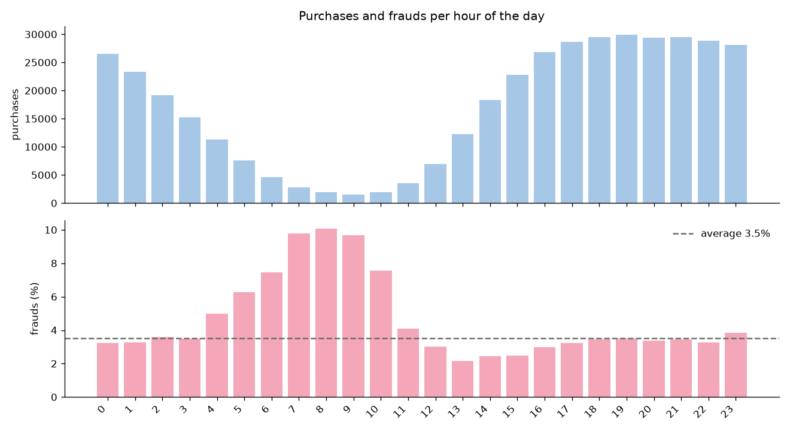

# fraud-detection

**Card fraud detection built the way a bank would run it.**

Most fraud projects on public data stop at "the model has a high score". A bank needs more: it has to know
how much money a model saves, how many honest customers it blocks, whether it still works next month, and
why a purchase was flagged. This project builds a fraud model on real e-commerce data with those questions
in mind.

> Work in progress: this README grows one step at a time.

## The data

[IEEE-CIS Fraud Detection](https://www.kaggle.com/competitions/ieee-fraud-detection/data), real online
purchases provided by Vesta (a payment protection company). Every row is **one online purchase made with a
card**. Customer, merchant and product are anonymised.

| | |
|---|---|
| purchases | 590,540 |
| columns | 394 (+ 41 in the identity table) |
| frauds | 20,663 (**3.5%**, about 1 purchase in 29) |
| period | 182 days (~6 months) |

**What "fraud" means here.** A purchase is fraud when the card owner disputed it with the bank
(chargeback). The purchases that follow it with the same account, email or billing address are marked as
fraud too: the label follows the person behind the fraud, not only the single purchase.

**The columns**

| columns | what they are |
|---|---|
| `TransactionDT` | time, in seconds from a hidden start (not a real date) |
| `TransactionAmt` | amount in USD |
| `ProductCD` | type of product (code) |
| `card1`–`card6` | anonymised card information (network, debit/credit, bank, country) |
| `addr1`, `addr2` | billing region and country (codes) |
| `dist1`, `dist2` | distances (e.g. between billing and shipping address) |
| `P_emaildomain`, `R_emaildomain` | email domain of buyer and receiver |
| `C1`–`C14` | counts (e.g. how many addresses are linked to the card) |
| `D1`–`D15` | days passed (e.g. since the card was first seen) |
| `M1`–`M9` | matches, true/false (e.g. name on card = name at address) |
| `V1`–`V339` | features built by Vesta, anonymous |
| identity table | device and browser (`DeviceType`, `DeviceInfo`, `id_01`–`id_38`) |

## Exploratory analysis

**Method.** The analysis uses only the first 4 months: the last 2 months are kept hidden as the final test
of the model. For every feature, three questions:
1. How many values are missing, and is the fraud rate different when the value is missing?
2. Which values or groups have more frauds? (numbers: 10 groups with the same number of purchases;
   codes: the most frequent values)
3. Is the feature useful?

**Accuracy is not a metric here.** With 3.5% of frauds, a model that always says "not fraud" is right
96.5% of the time and finds no fraud at all.

**Time.** The fraud rate changes month by month (from 2.5% to 4%), so the model is trained on the past
and tested on the future, never on a random split. At night frauds are 3x more frequent (10% vs 3%), but
most frauds still happen during the day, when there are many more purchases.



**What the data says**

| feature | finding |
|---|---|
| ProductCD | type C: 11% fraud, 3x the average; type W, the most common, is the safest (2%) |
| card6 | credit cards: 6.6% fraud vs 2.4% for debit cards |
| card3 | one value (probably foreign cards): 12.4% fraud on 40,000 purchases |
| C1 | the higher the count, the more fraud (2.4% → 8.6%) |
| D1 | cards seen recently are riskier (4.6% vs 1.3% for cards older than a year) |
| addr1 | when the billing address is missing: 11% fraud, 3x the average |
| R_emaildomain | with a receiver email (buying for someone else): up to 15% fraud |
| P_emaildomain | internet provider emails (att, verizon) are very safe (under 0.5%) |
| TransactionAmt | weak alone: more fraud for very small and very large amounts |

**Missing values carry information.** A value is not missing by chance: it describes how the purchase
happened. Without a billing address, fraud is 3x the average; with a receiver email, it is up to 4x. So
missing values are never filled with an average: they become "missing yes/no" features.

## Plan

1. Exploration ✔ (in progress: C, D, M, V columns and identity table)
2. Split by time and money-based metric
3. Features: rebuild the customer and its history, using only the past
4. Simple rules, as a bank would start
5. Model and threshold chosen in money
6. Explanations of every flag
7. Links between cards (shared email, device, address)
8. An investigator agent that explains each alert to the analyst
9. Analyst app
10. Drift monitoring

## Getting started

```bash
python -m venv .venv
source .venv/bin/activate
pip install -e .
```

Download `train_transaction.csv` and `train_identity.csv` from the
[Kaggle competition page](https://www.kaggle.com/competitions/ieee-fraud-detection/data) (join the
competition first) and put them in `data/raw/`. The data is not committed to git.

The exploratory analysis (time, then feature by feature) is in `notebooks/01_eda.ipynb`; its charts are
saved in `docs/images/`.